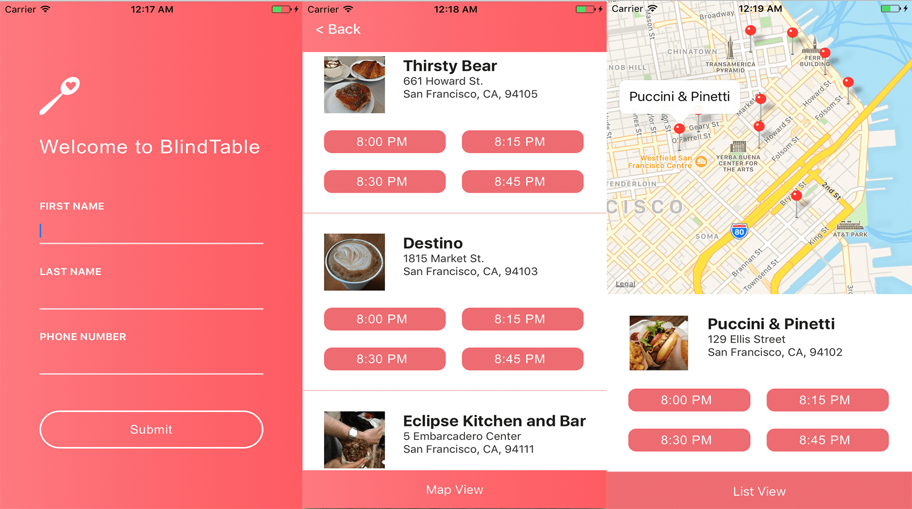

#BlindTable - Reactathon 2017

##Members:
- Daniel Chang
- David Hu
- Edwin La
- Elif Sezgin
- Raymond Lee

##Product

## Background

BlindTable is a mobile app for Reactathon2017 built in 2 days. While we are more "connected" than ever before, we are also more alone. It's easy to forget the value of a conversation for no reason. BlindTable allows users to make reservations at nearby restaurants to meet with strangers and aims to help make our cities feel more like neighborhoods. The application utilizes Twilio API for user authentication and OpenTable API to search for restaurants and make reservations.

Backend was built using Ruby on Rails and PostgreSQL: [BlindTable_BE][backend]

[backend]: https://github.com/rlee0525/BlindTable_BE

## Architecture and Technologies

- React Native (iOS / Android)
- Rails
- API Authy / Twilio (text messaging)
- OpenTable API
